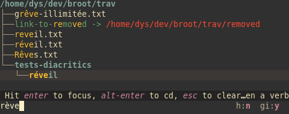

# Secular

[![MIT][s2]][l2] [![Latest Version][s1]][l1] [![Chat on Miaou][s3]][l3]

[s1]: https://img.shields.io/crates/v/secular.svg
[l1]: https://crates.io/crates/secular

[s2]: https://img.shields.io/badge/license-MIT-blue.svg
[l2]: LICENSE

[s3]: https://miaou.dystroy.org/static/shields/room.svg
[l3]: https://miaou.dystroy.org/3?broot

Provide a lowercased diacritics-free version of a character or a string.

For example return `e` for `é`.

Secular's char lookup is an inlined lookup of a static table, which means it's possible to use it in performance sensitive code.

Secular also performs (optionally) Unicode normalization.

A common use case for the removal of diacritics and some unicode arterfacts is to ease searches:



(diacritics ignoring normalized search in [broot](https://dystroy.org/broot): the user typed `rève`)

## Declaration

By default, diacritics removal is only done on ascii chars, so to include a smaller table.

If you want to handle the whole BMP, use the "bmp" feature" (the downside is that the binary is bigger as it includes a big map).

Default import:

	[dependencies]
	secular = "0.3"

For more characters (the BMP):

	[dependencies]
	secular = { version="0.3", features=["bmp"] }

With Unicode normalization functions (using the unicode-normalization crate):

	[dependencies]
	secular = { version="0.3", features=["normalization"] }

or

	[dependencies]
	secular = { version="0.3", features=["bmp","normalization"] }

This feature is optional so that you can avoid importing the unicode-normalization crate (note that it's used in many other crates so it's possible your text processing application already uses it).

## Usage

On characters:

```rust
use secular::*;
let s = "Comunicações"; // normalized string (length=12)
let chars: Vec<char> = s.chars().collect();
assert_eq!(chars.len(), 12);
assert_eq!(chars[0], 'C');
assert_eq!(lower_lay_char(chars[0]), 'c');
assert_eq!(chars[8], 'ç');
assert_eq!(lower_lay_char(chars[8]), 'c');
```

On strings:

```rust
use secular::*;
let s = "Comunicações"; // unnormalized string (length=14)
assert_eq!(s.chars().count(), 14);
let s = normalized_lower_lay_string(s);
assert_eq!(s.chars().count(), 12);
assert_eq!(s, "comunicacoes");
```
